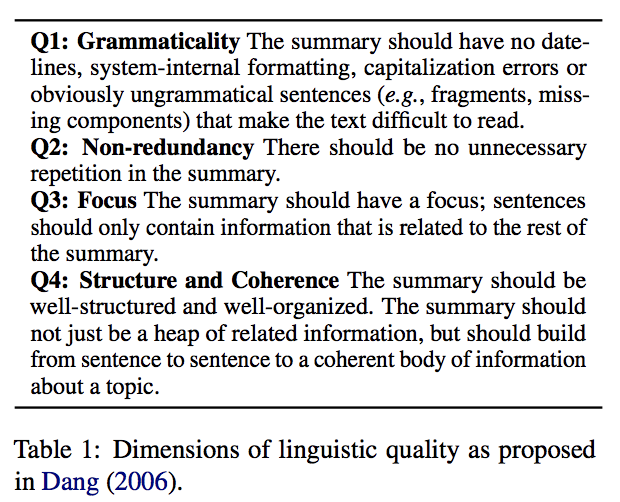

[](https://opensource.org/licenses/MIT)
# GRUEN for Evaluating Linguistic Quality of Generated Text

This repo is the GRUEN metric implementation of [GRUEN for Evaluating Linguistic Quality of Generated Text](https://arxiv.org/pdf/2010.02498.pdf) (Findings of EMNLP 2020). 


## Table of Contents
- [Introduction](#Introduction)
- [Code](#Code)
- [Dataset](#Dataset)
- [Related Papers](#Related-Papers)
- [Citation](#Citation)


## Introduction
GRUEN aims at evaluating the __linguistic quality__ of generated text from machine learning models.
Specifically, it aims to capture the four linguistic dimensions in Table 1. 

<p align="center"></p>


GRUEN has been shown to correlate well with human judgments on 13 datasets over the five natural language generation tasks below: 
- Abstractive Text Summarization
- Machine Translation
- Dialogue System
- Text Simplification
- Text Compression


## Code:
The code is based on Python 3. 
1) Install the dependencies as below: 
    ```
    pip install -r requirements.txt
    ```
    or using conda environment file:
    ```
    conda env create --file environment.yml
    ```

2) Use shell inscript to download CoLa models.  
```chmod u+x install.sh & ./install.sh```

3) Run main.py for an example usage.   
  ```python -m main```  


## Dataset
It is critically important to collect human judgments (_i.e._, the manual linguistic quality annotation score) of the system output.  

To ease future research on proposing novel evaluation metrics, we summarize some benchmark datasets below. 
For license issues, we are unable to provide links for downloading the data and the human judgments. 
We, however, point out how you can access them. 
 

__Abstractive Text Summarization__:
- _CNN/Daily Mail_: The dataset is originally proposed by [Hermann et al. (2015)](https://papers.nips.cc/paper/5945-teaching-machines-to-read-and-comprehend.pdf) and [Nallapati et al. (2016)](https://www.aclweb.org/anthology/K16-1028.pdf). The human judgments are collected by [Chaganty et al. (2018)](https://www.aclweb.org/anthology/P18-1060.pdf). 
- _TAC-2011_: Please refer to [the link here](https://tac.nist.gov/data/past/2011/Summ11.html).
- _DUC2005, DUC2006, DUC2007_: Please refer to [the link here](https://www-nlpir.nist.gov/projects/duc/data.html). 

__Machine Translation__: 
- _WMT16_: Please refer to [the link here](http://www.statmt.org/wmt16/). It has six human annotated datasets (_i.e._, cs-en, de-en, fi-en, ro-en, ru-en, tr-en). 

__Dialogue System__:
- _BAGEL_: The dataset is originally proposed by [Mairesse et al. (2010)](https://www.aclweb.org/anthology/P10-1157.pdf). The human judgments are collected by [Novikova et al. (2017)](https://www.aclweb.org/anthology/D17-1238.pdf).
- _SFHOTEL_: The dataset is originally proposed by [Wen et al. (2015)](https://www.aclweb.org/anthology/D15-1199.pdf). The human judgments are collected by [Novikova et al. (2017)](https://www.aclweb.org/anthology/D17-1238.pdf).
- _SFREST_: The dataset is originally proposed by [Wen et al. (2015)](https://www.aclweb.org/anthology/D15-1199.pdf). The human judgments are collected by [Novikova et al. (2017)](https://www.aclweb.org/anthology/D17-1238.pdf).

__Text Simplification__:
- _[Xu et al. (2016)](https://www.aclweb.org/anthology/Q16-1029.pdf)_: The dataset is available [here](https://github.com/cocoxu/simplification/). Please email the first author to ask for the human judgments.

__Text Compression__:
- _[Toutanova et al. (2016)](https://www.aclweb.org/anthology/D16-1033.pdf)_: Please refer to the [paper](https://www.aclweb.org/anthology/D16-1033.pdf). 


## Related Papers
- [Dang (2006)](https://duc.nist.gov/pubs/2006papers/duc2006.pdf): Overview of DUC 2006 (Document Understanding Conference 2006)
- [Hermann et al. (2015)](https://papers.nips.cc/paper/5945-teaching-machines-to-read-and-comprehend.pdf): Teaching machines to read and comprehend (NIPS 2015)
- [Nallapati et al. (2016)](https://www.aclweb.org/anthology/K16-1028.pdf): Abstractive text summarization using sequence-to-sequence RNNs and beyond (CoNLL 2016)
- [Chaganty et al. (2018)](https://www.aclweb.org/anthology/P18-1060.pdf): The price of debiasing automatic metrics in natural language evaluation (ACL 2018)
- [Mairesse et al. (2010)](https://www.aclweb.org/anthology/P10-1157.pdf): Phrase-based statistical language generation using graphical models and active learning (ACL 2010)
- [Wen et al. (2015)](https://www.aclweb.org/anthology/D15-1199.pdf): Semantically conditioned LSTM-based natural language generation for spoken dialogue systems (EMNLP 2015)
- [Novikova et al. (2017)](https://www.aclweb.org/anthology/D17-1238.pdf): Why we need new evaluation metrics for NLG (EMNLP 2017)
- [Xu et al. (2016)](https://www.aclweb.org/anthology/Q16-1029.pdf): Optimizing statistical machine translation for text simplification (TACL 2016)
- [Toutanova et al. (2016)](https://www.aclweb.org/anthology/D16-1033.pdf): A dataset and evaluation metrics for abstractive compression of sentences and short paragraphs (EMNLP 2016) 


## Citation
If you find this repo useful, please cite:
```bibtex
@inproceedings{zhu2020gruen,
  title={GRUEN for Evaluating Linguistic Quality of Generated Text},
  author={Zhu, Wanzheng and Bhat, Suma},
  booktitle={Proceedings of the 2020 Conference on Empirical Methods in Natural Language Processing: Findings},
  pages={94--108},
  year={2020}
}
```
